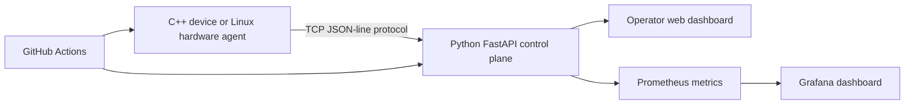

# Edge SRE Hardware Lab

A reproducible, hardware-aware reliability lab built to demonstrate junior SRE, DevOps, Linux, infrastructure and control-software skills.

[Read the complete training guide](TRAINING_GUIDE.md) · [Read the DevSecOps/SRE playbook](DEVSECOPS_SRE_PLAYBOOK.md) · [See the skills evidence map](SKILLS_MATRIX.md) · [Open the portfolio site](https://parrsi01.github.io/edge-sre-hardware-lab/) · [Download the illustrated PDF guide](docs/assets/SRE_BEGINNER_GUIDE_IP4IT_GENEVA.pdf)

## What the project proves

The stack connects a C++ device simulator to a Python control plane. It validates telemetry, exposes a REST API and Prometheus metrics, displays operational state, injects a safe failure, and demonstrates verified recovery. Docker Compose makes the four-service deployment repeatable, while CI compiles the C++ component and runs the Python tests.

The same documented protocol can later be served by an approved Raspberry Pi, mini-PC or other Linux host. Until that physical stage is completed, this remains a local simulation—not production, data-centre, FPGA or CERN experience.

## Architecture



| Layer | Evidence |
|---|---|
| C++ device | Sockets, device state, telemetry and controlled faults |
| Python control plane | Async polling, validation, REST and graceful degradation |
| Operator dashboard | Current health, readiness and recovery control |
| Prometheus/Grafana | Metrics, time-series inspection and availability evidence |
| Docker Compose | Reproducible deployment and health checks |
| GitHub Actions | Automated C++ build, Python tests and configuration validation |
| Linux hardware agent | `systemd`, host telemetry and the path to a physical node |

## Run it on macOS

Prerequisites: Git, Docker-compatible Compose, `make`, Python 3 and CMake. The setup script can install supported dependencies with Homebrew and start Colima.

```bash
git clone https://github.com/parrsi01/edge-sre-hardware-lab.git
cd edge-sre-hardware-lab
make setup
make up
open http://localhost:8000
make demo
```

Views:

- Operator dashboard: `http://localhost:8000`
- API documentation: `http://localhost:8000/docs`
- Prometheus: `http://localhost:9090`
- Grafana: `http://localhost:3000/d/edge-sre-lab`

Run the complete verification with `./scripts/verify.sh`; stop the stack with `make down`.

## Five-minute demonstration

1. Explain the device → control plane → metrics → operator path.
2. Show fresh healthy telemetry.
3. Select **Inject fault** and explain why liveness remains available while readiness fails.
4. Inspect the failed polls and error state.
5. Select **Recover device**, wait for a fresh successful sample, and show readiness returning.
6. Open the tests and state the evidence boundary.

## Geneva training use

The proposed in-person extension is designed for IP4IT / Geneva Business News. Their public pages describe daily practice across support, development, systems and networking, a weekly IT session, technical presentations, labs, and named tools including GLPI, OCS, Nagios and Wireshark. The project uses those published pillars as a training map; it does **not** claim that IP4IT offers an SRE position, guarantees equipment, placement, funding, supervision or employment.

The requested supervised outcome is narrow and verifiable: deploy the supplied agent to one approved Linux host, observe three controlled incidents, define and measure a small SLO, complete a restore drill, and have another participant reproduce the runbook.

## DevSecOps and SRE extension

The [DevSecOps/SRE playbook](DEVSECOPS_SRE_PLAYBOOK.md) turns the local demo into a six-week **Secure Edge Platform** proposal. It maps recurring current Swiss role themes—Linux, Docker, Kubernetes, Terraform/OpenTofu, Ansible/Puppet, GitLab/GitHub CI, Prometheus/Grafana, log platforms, security gates, virtualization and incident response—to evidence that exists now, evidence that needs supervised IP4IT work, and claims that must not yet be made. Docker/Compose, Prometheus/Grafana, GitHub Actions and the controlled recovery drill are already present. Kubernetes, VMware/Hyper-V, GitLab CI, IaC and production security tooling are proposed next steps only after the centre approves the environment.

The playbook also defines a bounded, authorized non-production reliability review as a possible future service. It is not a promise of income, employment, seniority or Swiss work authorization.

## Employment evidence—not a guarantee

Current official Geneva figures do not support claiming a local “SRE employment surge.” OCSTAT reports that Geneva full-time-equivalent employment rose 0.8% in 2024 and 1.0% quarter-on-quarter in Q2 2026, while the Geneva information-and-communication branch fell 1.7% in 2024. A Swiss ICT workforce study published by ICT-Berufsbildung Schweiz forecasts 61,600 additional ICT positions through 2033, plus 67,000 replacement needs; this is a national projection across industries, not a Geneva vacancy count or a guarantee for a junior candidate.

That evidence supports learning portable operations skills—Linux, networking, observability, automation, incident response and secure deployment—while continuing direct applications. See [TRAINING_GUIDE.md](TRAINING_GUIDE.md) for the source links, interpretation and six-week evidence plan.

## Repository map

| Path | Purpose |
|---|---|
| `device-simulator/` | C++ TCP service, telemetry and fault state |
| `control-api/` | Python/FastAPI polling, validation, API, metrics and dashboard |
| `observability/` | Prometheus and Grafana configuration |
| `hardware-agent/` | Optional real Linux/Raspberry Pi replacement |
| `scripts/` | Setup, readiness, demonstration and verification workflows |
| `docs/` | GitHub Pages case study and downloadable guide |
| `tools/` | Reproducible PDF-guide generators |
| `.github/workflows/ci.yml` | Public continuous-integration checks |

## Security boundary

The local ports bind to `127.0.0.1` and the lab uses synthetic telemetry. Do not expose the unauthenticated control endpoints to a shared network. Never capture other users’ traffic or test systems without written authorization. Read [SECURITY.md](SECURITY.md) before adding a physical host.

## Sources checked 19 September 2026

- [OCSTAT: Geneva employment, Q2 2026 and detailed 2024 figures](https://statistique.ge.ch/actualites/welcome.asp?Actudomaine=06_02&aaaa1=2026&aaaa2=2026&actu=6016&mm1=05/01&mm2=12/31&num=0)
- [ICT-Berufsbildung Schweiz: ICT workforce requirements through 2033](https://www.ict-berufsbildung.ch/resources/BSS-Schlussbericht-ICT-Bildungsbedarf-2033-2025-09_09.pdf)
- [IP4IT official programme page](https://www.ip4it.ch/)
- [Geneva Business News IT programme page](https://genevabusinessnews.ch/it/)
- [Google Site Reliability Engineering book](https://sre.google/sre-book/table-of-contents/)
- [CERN DevOps Engineer for Large Scale Compute](https://careers.cern/jobs/devops-engineer-for-large-scale-compute/)
- [CERN Information Technologies vacancies](https://careers.cern/explore-careers/information-technologies/)
- [Proton SRE Infrastructure Systems](https://job-boards.eu.greenhouse.io/proton/jobs/4848439101?gh_src=6b341c62teu)
- [Proton SRE Application Edge](https://job-boards.greenhouse.io/proton/jobs/4612377101)
- [adesso Senior SRE](https://www.adesso.ch/de_ch/jobs-karriere/unsere-stellenangebote/Senior-Site-Reliability-Engineer-all-genders-de-j2900.html)
- [PostFinance CI platform role](https://jobs.postfinance.ch/offene-stellen/product-owner-continuous-integration-plattformen-w-m-d/4c9a3fca-6325-4494-86e5-19452b333564)

Statistics, vacancies, prices and programme availability can change. Recheck them before making a decision.
